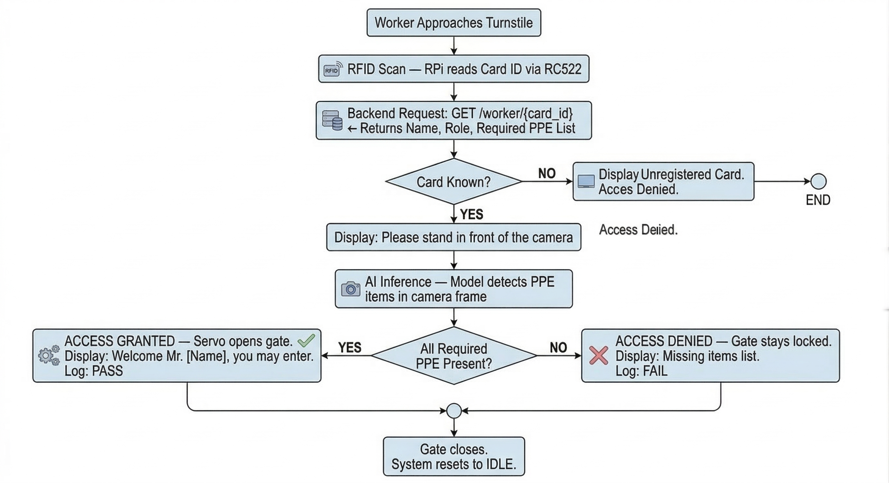
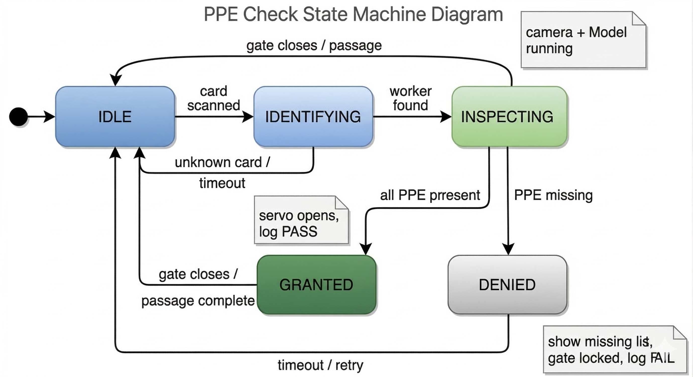
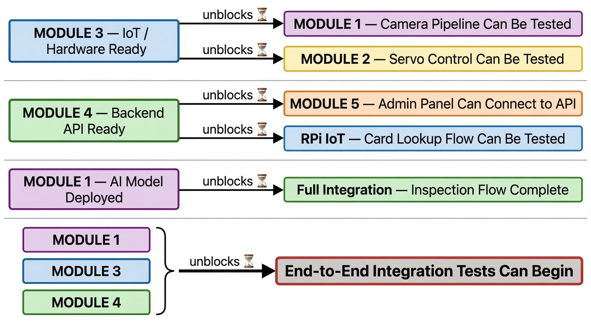

# AI-Powered Smart PPE Inspection Station

> **Gebze Technical University - Department of Computer Engineering**
> **CSE 396 - Computer Engineering Project | Spring 2026 | Group 11**
>
> An automated safety gate system for industrial environments (factories, construction
> sites) that combines RFID-based identity verification with edge AI vision inference
> running on a Raspberry Pi 5. When a worker scans their RFID card, the system fetches
> their role-specific PPE requirements from the backend, runs a YOLOv8n object detection
> model on the live camera frame, and either opens the turnstile gate or blocks entry -
> all in under 10 seconds, without any cloud dependency.
>
> The system is built as a two-sided architecture:
> - **Turnstile Side** - Raspberry Pi 5 running AI inference, RFID reading, gate control, and the turnstile display.
> - **Admin Side** - Web application for registering workers, assigning RFID cards, defining job roles and PPE requirements, and viewing compliance reports.
>
> Both sides communicate over a local Wi-Fi LAN via HTTP REST.

---

## Group Members

| Name | Student ID | Primary Module | Secondary Module |
|---|---|---|---|
| Zeynep Etik | 220104004035 | MOD-01 - AI & Vision | MOD-03 - IoT |
| Alperen Söylen | 220104004024 | MOD-03 - IoT | MOD-01 - AI & Vision |
| Mümincan Durak | 210104004057 | MOD-02 - Turnstile | MOD-03 - IoT |
| Muhammed Emir Kara | 210104004071 | MOD-02 - Turnstile | MOD-01 - AI & Vision |
| Ahmet Emre Kurt | 220104004016 | MOD-04 - Backend | MOD-02 - Turnstile |
| Hüseyin Elyesa Yeşilyurt | 210104004080 | MOD-04 - Backend | MOD-03 - IoT |
| Tarık Saeede | 200104004804 | MOD-05 - UI/UX | MOD-04 - Backend |
| Emre İlhan Şenel | 230104004907 | MOD-05 - UI/UX | MOD-03 - IoT |

> P = Primary (main responsibility) · S = Secondary (support & cross-learning)

---

## Repository Structure

```
.
├── app/                       # MOD-01 - AI & Vision
├── turnstile/                 # MOD-02 - Turnstile Gate Control
├── backend/                   # MOD-04 - Backend & Database
└── mobile/                    # MOD-05 - UI/UX (Turnstile Display + Admin Panel)
```

---

## System Architecture


### Module Overview

| Module | Name | Language / Stack | Runs On |
|---|---|---|---|
| MOD-01 | AI & Vision | Python 3.11, YOLOv8n, ONNX Runtime, OpenCV | Raspberry Pi 5 (Hailo-8L NPU) |
| MOD-02 | Turnstile Gate Control | Python 3.11, PWM, PCA9685 I2C | Raspberry Pi 5 |
| MOD-03 | IoT Orchestrator | Python 3.11, HTTP, SPI (RC522) | Raspberry Pi 5 |
| MOD-04 | Backend & Database | Node.js 20, Express 5, PostgreSQL 14, Prisma | Local server / dev machine |
| MOD-05 | UI/UX | React 18, TypeScript 5, Tailwind CSS, WebSocket | Browser / Tablet |

### Inspection Flow



### Inspection State Machine



### Module Dependencies



---

## Module Descriptions

### MOD-01 - AI & Vision
**Owners:** Zeynep Etik (Primary), Alperen Söylen (Secondary), Muhammed Emir Kara (Secondary)

Trains and deploys a YOLOv8n object detection model fine-tuned on the Ultralytics
Construction PPE Dataset (supplemented from Roboflow / Kaggle). The trained model is
converted to ONNX format with INT8 post-training quantization and deployed on the
Raspberry Pi 5 Hailo-8L NPU for accelerated inference.

Detects: `hard_hat`, `safety_vest`, `gloves`, `safety_boots`, `face_mask`, `safety_goggles`
(and their negative counterparts: `no_helmet`, `no_gloves`, etc.).

**Public API:** `module_01_ai_vision/include/module_ai_vision.py`
```python
detect(frame: CameraFrame) -> DetectionResult
# Returns the set of detected PPE class labels and confidence scores.
```

---

### MOD-02 - Turnstile Gate Control
**Owners:** Mümincan Durak (Primary), Muhammed Emir Kara (Primary), Ahmet Emre Kurt (Secondary)

Covers physical design and electromechanical control of the turnstile gate. The gate
arm mechanism is designed in CAD and fabricated using 3D printing or acrylic/aluminium.
Two high-torque servo motors are driven by PWM signals through a PCA9685 I2C PWM
controller connected to the Raspberry Pi 5 GPIO. Exposes a minimal open/close API
consumed exclusively by MOD-03.

**Public API:** `turnstile/gate_control.py`
```python
gate_open(direction)  # Opens gate for DIR_ENTRY or DIR_EXIT; auto-closes after timeout.
gate_close()          # Returns both servos to closed position (90°).
```

---

### MOD-03 - IoT Orchestrator
**Owners:** Alperen Söylen (Primary), Zeynep Etik / Mümincan Durak / Emre İlhan Şenel / Hüseyin Elyesa Yeşilyurt (Secondary)

The central coordinator on the Raspberry Pi 5. Manages the full inspection state
machine (IDLE - IDENTIFYING - INSPECTING - GRANTED / DENIED). Reads RFID via
RC522 (SPI), queries MOD-04 for worker identity and required PPE, calls MOD-01 for
detection, controls MOD-02, posts the entry log to MOD-04, and pushes real-time
`DisplayMessage` updates to MOD-05 over WebSocket. Also manages GPIO pin assignments,
camera pipeline setup, and power distribution wiring for all peripherals.

**Public API:** `module_03_iot/include/` (Python ABCs)
```python
rfid.read_card() -> str   # Returns card_id string on successful scan.
```

---

### MOD-04 - Backend & Database
**Owners:** Ahmet Emre Kurt (Primary), Hüseyin Elyesa Yeşilyurt (Primary), Tarık Saeede (Secondary)

Central REST API server (Express 5 + PostgreSQL) that stores and serves all persistent
data. The database schema is centred on `workers`, `roles`, `ppe_items`,
`role_ppe_requirements`, and `entry_logs`. Role-to-PPE mapping uses a junction table
(not a single list column). Inspection outcomes use `PASS` / `FAIL` / `UNKNOWN_CARD`
semantics. Missing PPE is derived in API responses rather than stored redundantly.

**Public API:** `module_04_backend/backend.d.ts`
**Swagger UI:** `GET /docs` (when server is running)

Key endpoints:
```
GET  /api/workers/card/:uid   - worker profile + required PPE list
POST /api/entry-logs          - write inspection result
GET  /api/workers             - worker list (Admin Panel)
GET  /api/roles/:id/ppe       - PPE requirements for a role
GET  /api/entry-logs/stats    - compliance statistics
GET  /api/health              - liveness check
```

---

### MOD-05 - UI/UX
**Owners:** Tarık Saeede (Primary), Emre İlhan Şenel (Primary)

Two React applications:

**Admin Panel** (`module_05_ui_ux/admin_panel/`) - Web application for administrators.
Worker registration forms, RFID card assignment, job role and PPE requirement
management, entry log viewer, and compliance statistics dashboard. Communicates
with MOD-04 via REST.

**Turnstile Display** (`module_05_ui_ux/mobile/`) - Tablet application mounted at
the turnstile. Receives real-time `DisplayMessage` pushes from MOD-03 over WebSocket
and renders animated IDLE / IDENTIFYING / INSPECTING / GRANTED / DENIED screens
with a live camera feed and bounding boxes during inspection.

**Interface files:** `module_05_ui_ux/admin_panel/admin_side_interface.d.ts`,
`module_05_ui_ux/mobile/include/display_interface.d.ts`

---

## Hardware

### Component List

| # | Component | Model / Spec | Role |
|---|---|---|---|
| 1 | Raspberry Pi 5 | 16 GB RAM + Hailo-8L AI Kit | Main controller; runs AI, IoT logic, display |
| 2 | RPi Camera Module V3 | 12 MP, wide-angle, CSI interface | Frame capture for PPE detection pipeline |
| 3 | RC522 RFID Reader | ISO 14443A, SPI interface - x2 units | Card scanning (turnstile side + admin side) |
| 4 | RFID Cards / Tags | ISO 14443A cards - x10 | Worker identification tokens |
| 5 | Servo Motors | High-torque PWM - x2 | Gate lock and rotation mechanism |
| 6 | Servo Driver | PCA9685 16-channel I2C PWM board | Translates I2C commands from RPi to PWM signals |
| 7 | Display / Tablet | 7" touchscreen or HDMI monitor (TBD) | Turnstile-side inspection result display |
| 8 | Power Supply | LiPo battery + 5 V/5 A regulator | Powers RPi 5, servos, and peripherals |
| 9 | MicroSD Card | Samsung Evo Plus 128 GB | OS and model storage |
| 10 | Chassis / Frame | 3D-printed or acrylic/aluminium | Physical turnstile structure |

### Communication Buses

| Bus / Protocol | Connected Devices | Notes |
|---|---|---|
| SPI | RC522 RFID Reader - RPi 5 | Card read operations |
| CSI | Camera Module V3 - RPi 5 | 15-30 fps at 1080p (or lower for inference) |
| I2C | PCA9685 - RPi 5 GPIO | Servo PWM control (address 0x40) |
| HDMI / DSI | RPi 5 - Display | Turnstile display output |
| Wi-Fi 802.11ac | RPi 5 - Backend Server - Admin Panel PC | HTTP REST over local network |

### Performance Targets

| Parameter | Target | Notes |
|---|---|---|
| Total Inspection Cycle | < 10 s | Card scan - AI inference - gate decision |
| AI Inference Latency | < 3 s / frame | INT8 quantized model on Hailo-8L NPU |
| Camera Frame Rate | 15-30 fps | Lower resolution may be used to meet latency target |
| PPE Detection Accuracy | >= 85% | On test set under normal indoor lighting |

---

## Software Stack

| Library / SDK | Purpose | License |
|---|---|---|
| Raspberry Pi OS 64-bit (Bookworm) | Operating system for RPi 5 | Free |
| Python 3.11+ | Primary development language for all RPi modules | Open Source |
| Ultralytics / YOLOv8n | Object detection model training | AGPL-3.0 |
| ONNX Runtime | Optimised model inference on RPi (INT8) | Open Source |
| OpenCV | Camera capture and image preprocessing | Open Source |
| gpiozero / RPi.GPIO | GPIO control for RFID, servos, display | Open Source |
| Node.js + Express 5 | REST API backend service | Open Source |
| PostgreSQL 14 + Prisma | Relational database and ORM | Open Source |
| React 18 + TypeScript 5 | Admin Panel and Turnstile Display frontend | Open Source |
| Git / GitHub | Version control and team collaboration | Free (student) |

---

## Development Approach

- **API-First:** All module interfaces and REST API contracts are defined and frozen in Phase 1 before any module begins implementation, enabling all five modules to be developed in parallel.
- **Feature-Branch Workflow:** Each module has its own development branch; code merges to `main` only after peer review.
- **Mock APIs During Development:** Modules that depend on other modules use mock API responses during early development.
- **Weekly Sync Meetings:** Weekly stand-ups track progress, identify blockers, and synchronise module interfaces.
- **Testing Strategy:** Each module is individually unit-tested before integration. End-to-end tests cover three core scenarios: compliant worker with full PPE, worker with missing PPE, and unregistered card.

### Project Timeline


---

## License

This project is developed for academic purposes as part of CSE 396 at the
Department of Computer Engineering, Gebze Technical University. Spring 2026.
